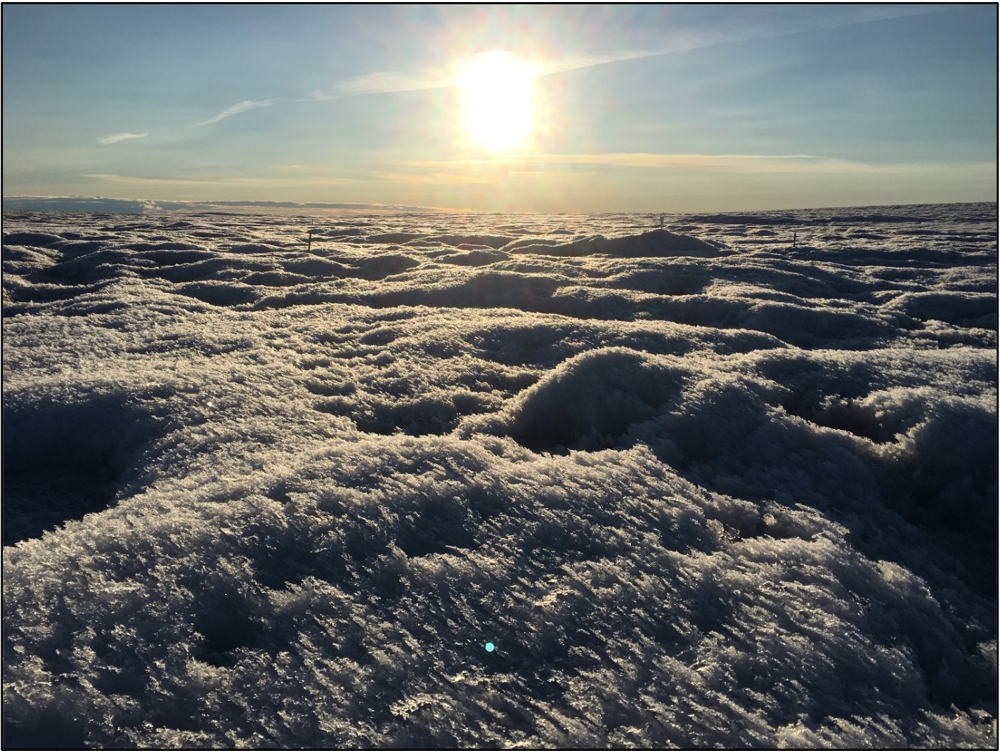
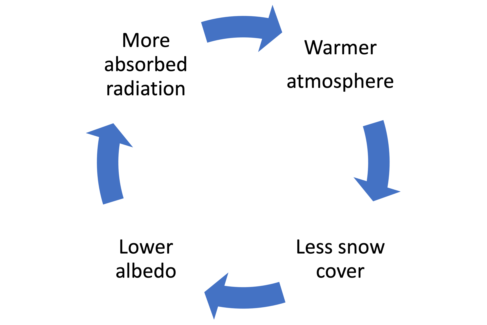
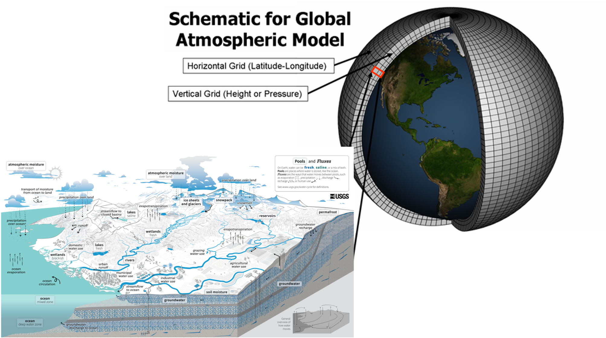
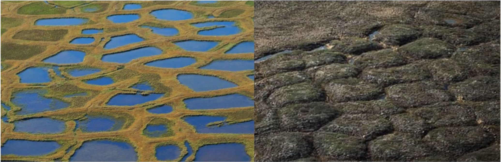
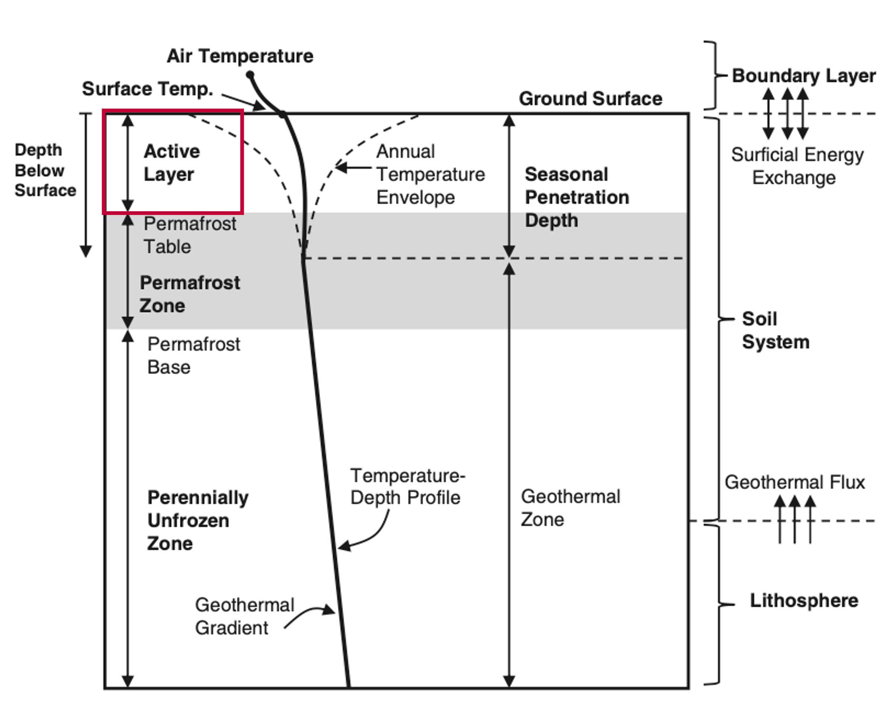
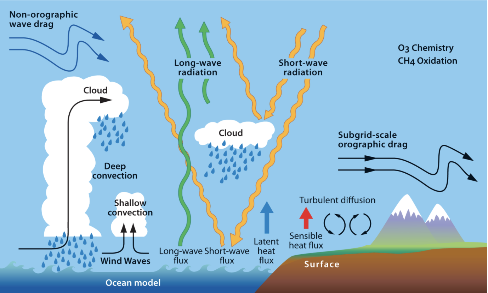
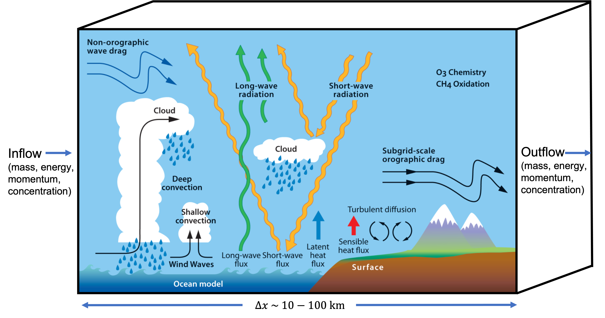
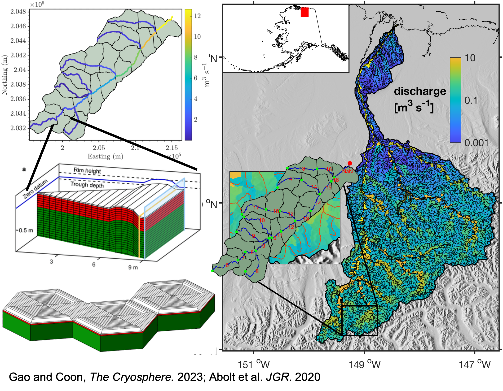
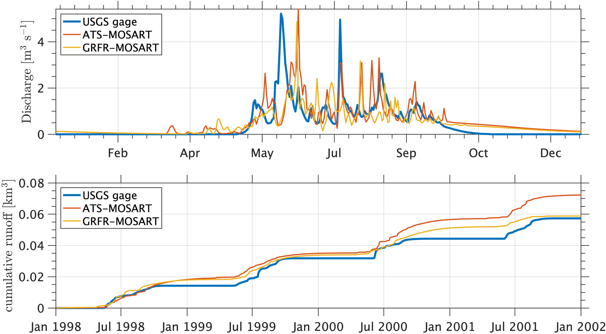
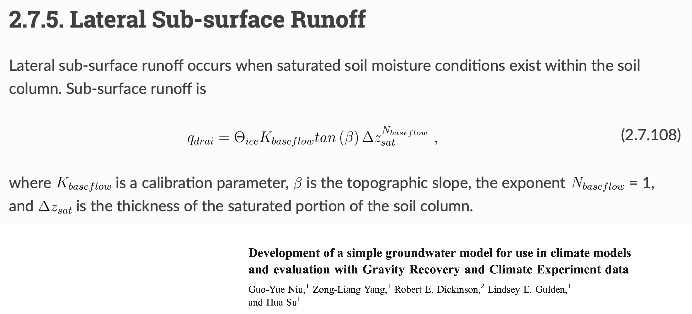

<!-- slides_GCEE6320_28Mar23_Matt_Cooper -->

<!-- _class: lead invert --> # center justify this slide
<!-- _footer: "28 March 2023" --> # add a footer to this slide

# High-Latitude Hydroclimatology: Modeling the Cryosphere

Matt Cooper
Pacific Northwest National Laboratory
28 March 2023
matt.cooper@pnnl.gov

<!--  -->

<!-- 
Some smaller text at the footer of the page.
 -->

---

## Importance of High-Latitude Hydroclimatology <!-- fit -->

<!-- use this to scope a style to one slide -->

<!--  -->
<!--  -->

- Why do polar regions play a significant role in global climate?
    - The high albedo of snow and ice.
    - The large amount of freshwater stored in glaciers.
    - The large amount of carbon stored in permafrost.

<!-- In this image you can see at least three distinct features of the high latitude regions: snow covered sea ice, the greenland ice sheet, and vast expanses of tundra underlain by permafrost -->

---

## Importance of High-Latitude Hydroclimatology <!-- fit -->

<!-- use this to scope a style to one slide -->

- This lecture:
    - **The high albedo of snow and ice.**
    - **The large amount of carbon stored in permafrost.**
- Next lecture:
    - The large amount of freshwater stored in glaciers.    

---

## Learning Outcomes

- Understand the role of the cryosphere in the climate system.
- Understand polar amplification.
- Understand why sub-grid scale parameterizations are used.

---

## The High-Latitude Cryosphere: Sea Ice and Polar Snow

- Sea ice and polar snow influence global climate by reflecting sunlight, and acting as insulators that prevent heat exchange between the ocean and the atmosphere.
- Snow accumulation and melt affect the mass balance of polar ice sheets, which in turn influence global sea levels.

---

## High-latitude regions are especially sensitive to climate change <!-- fit -->

-  Why do high latitude regions experience more pronounced warming than other areas?
    - **Snow and ice reflect _more_ solar radiation than other surfaces.**

---

## High-latitude regions are especially sensitive to climate change <!-- fit -->

-  Why do high latitude regions experience more pronounced warming than other areas?
    - _Snow and ice reflect _more_ solar radiation than other surfaces._
        - **As earth warms, snow cover decreases and absorbed solar radiation increases, which causes more warming, more snow melt, and more absorption of solar radiation, leading to a positive feedback loop.**

---

<!-- This image shows the lowest observed sea ice extent on Aug 26, 2012. As sea ice extent shrinks, more water is exposed, which absorbs more heat, leading to more warming, and less sea ice. -->

NASA Goddard Space Flight Center from Greenbelt, MD, USA, Public domain, via Wikimedia Commons

---

RCraig09, CC BY-SA 4.0, via Wikimedia Commons

<!-- in addition to the ice albedo feedback, there are two other positive feedbacks related to the Cryosphere: changes in water vapor/clouds, and melting permafrost -->

---

## Polar Amplification

<!-- from the prior version -->
- Polar amplification refers to the increased rate of warming in the Arctic and Antarctic compared to the global average.
- This phenomenon is caused by various positive feedback mechanisms, such as the ice-albedo feedback and the release of greenhouse gases from thawing permafrost.

<!-- these mechanisms are referred to as polar amplification -->
<!-- we wont discuss water vapor, clouds, or lapse rate feedback, but if students are interested, the polar atmosphere can often have a lower lapse rate leading to less efficient longwave cooling from the TOA -->

---

## Polar Amplification

- High-latitude regions warm faster than the global average
    - Arctic: 2.5°C
    - Antarctic: 1.5°C
    - Global: 1.1°C
- Factors: Ice-albedo feedback, changes in atmospheric and oceanic circulation, and increased greenhouse gases.

https://commons.wikimedia.org/wiki/File:GISS_temperature_2000-09.png

<!-- 
- Polar amplification is the phenomenon where high-latitude regions warm faster than the global average due to various feedback mechanisms.
- Key factors contributing to polar amplification include ice-albedo feedback, changes in atmospheric and oceanic circulation, and increased greenhouse gas concentrations. 
-->

---

## Question: why are the northern latitudes warming more than the southern latitudes?

<!-- Question: Why is the north so much warmer than south? -->

---

## Global Climate Models for Hydroclimatology

- Climate models are essential tools for studying and predicting hydroclimatic processes in high-latitude regions.
- Accurately representing high-latitude processes in climate models is challenging due to the complex interactions between the atmosphere, ocean, and cryosphere.

---

<!-- _backgroundColor: white -->

---

## Permafrost Hydrology

- Permafrost is permanently frozen ground, and it affects the storage and movement of water in high-latitude regions.
- Thawing permafrost can release significant amounts of carbon dioxide and methane, both potent greenhouse gases, exacerbating climate change (permafrost-carbon feedback).

---

## Permafrost Hydrology

- Permafrost stores large amounts of carbon and water.
- Thawing permafrost affects hydrology, ecosystems, and infrastructure.

diagram: Kurylyk et al (2014) ESR

---

## Arctic methane emissions

---

## Permafrost Hydrology

- Permafrost is permanently frozen ground, and it affects the storage and movement of water in high-latitude regions.
- Thawing permafrost can release significant amounts of carbon dioxide and methane, both potent greenhouse gases, exacerbating climate change (permafrost-carbon feedback).

---

## Polygonal ground

---

## Polygonal ground

---

## Permafrost Hydrology

- Thawing permafrost affects hydrology, ecosystems, and infrastructure

image: Ethan Coon, AMANZI-ATS

---

## Sub-grid parameterization

- How do we represent this complexity in models? 
- Answer: sub-grid parameterizations

image: https://www2.cesm.ucar.edu/working_groups/Atmosphere/parameterizations/

---

## Sub-grid parameterization

<!-- _backgroundColor: white -->
<!-- _color: black -->

---

## Case Study: Representing permafrost in models <!-- fit -->

<!-- _backgroundColor: white -->
<!-- _color: black -->

---

<!-- _backgroundColor: white -->
<!-- _color: black -->

---

<!-- _backgroundColor: white -->
<!-- _color: black -->

- Observations show an earlier peak in spring
- Observations show fewer peaks in late summer

---

## Sub-grid parameterization of soil ice content

<!-- _backgroundColor: white -->
<!-- _color: black -->

- Represent the effect of soil ice content on lateral flow with parameter $\Theta_{ice}$

---

## Learning outcomes

- Understand the role of the cryosphere in the climate system.
- Understand polar amplification.
- Understand why sub-grid scale parameterizations are used.

---

## Learning outcomes

- Understand the role of the cryosphere in the climate system.
    - **High albedo of snow and ice.**
    - **Large amount of carbon stored in permafrost.**

---

## Learning outcomes

- _Understand the role of the cryosphere in the climate system._
- **Understand polar amplification.**
    - **The Arctic warming faster than the rest of the globe due to positive feedbacks in the climate system.**
    - **As the Arctic warms, snow cover declines, leading to more heat absorption, more warming, and more snow melt.**
    - **As the Arctic warms, permafrost melts, releasing carbon, leading to more warming, and more permafrost melt.**

---

## Learning outcomes

- _Understand the role of the cryosphere in the climate system._
- _Understand polar amplification._
- **Understand why sub-grid scale parameterizations are used.**
    - **Climate processes are complex, and it is not possible to represent them all in a climate model.**
    - **Sub-grid parameterizations capture the effects of processes that are not explicitly resolved in the model.**

---

## Recap and Takeaway Messages

- High-latitude hydroclimatology is critical for understanding global climate change.
- Climate models are essential tools for studying hydroclimatic processes.
- Polar amplification, sea ice, permafrost, and freshwater inputs play key roles.
- The accuracy of climate models is challenged by complex interactions between different components of the Earth system, and the necessity of representing them with sub-grid parameterizations.

--- 

## Questions?

---

