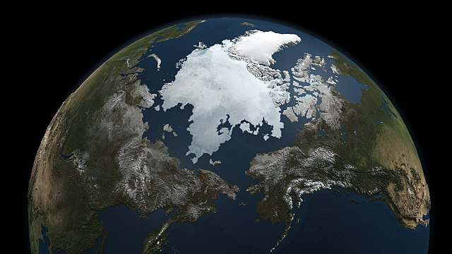

# GCEE 6320 Global Climate: Physical Models

Welcome 👋

Please find slides for GCEE 6320 Global Climate: Physical Models delivered during Spring term 2023 and 2024 at the University of Houston.

Spring 2023:

- High-Latitude Hydroclimatology: Modeling the Cryosphere, 28 March 2023.
- High-Latitude Hydroclimatology: Modeling Ice Sheet Surface Mass Balance, 30 March 2023.

Spring 2024:

- High-Latitude Hydroclimatology: Modeling the Cryosphere, 10 April 2024.
- High-Latitude Hydroclimatology: Modeling Ice Sheet Surface Mass Balance, 15 April 2024.

<!-- - GCEE6320_Day1_Matt_Cooper.md
- GCEE6320_Day2_Matt_Cooper.md -->

<!-- Please note: the Day 2 lecture is an abridged version. Please email me if you would like the full version that was presented in class. -->
