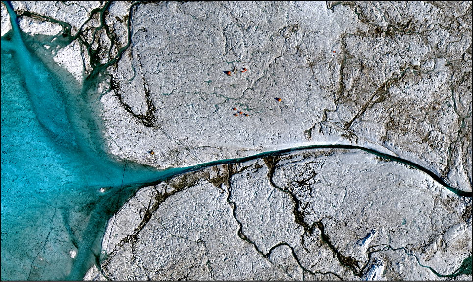
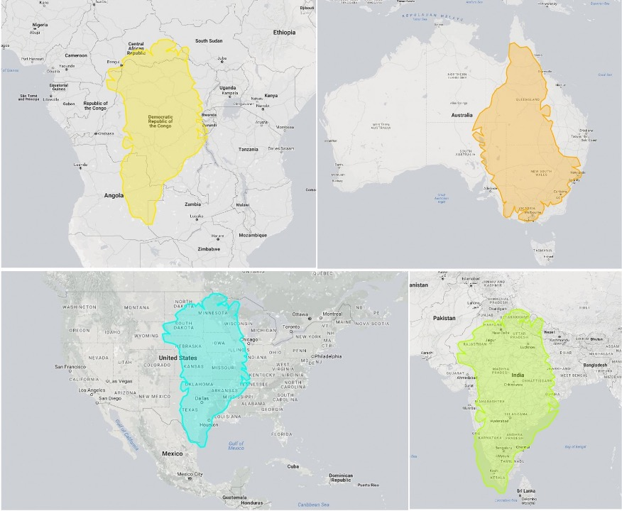
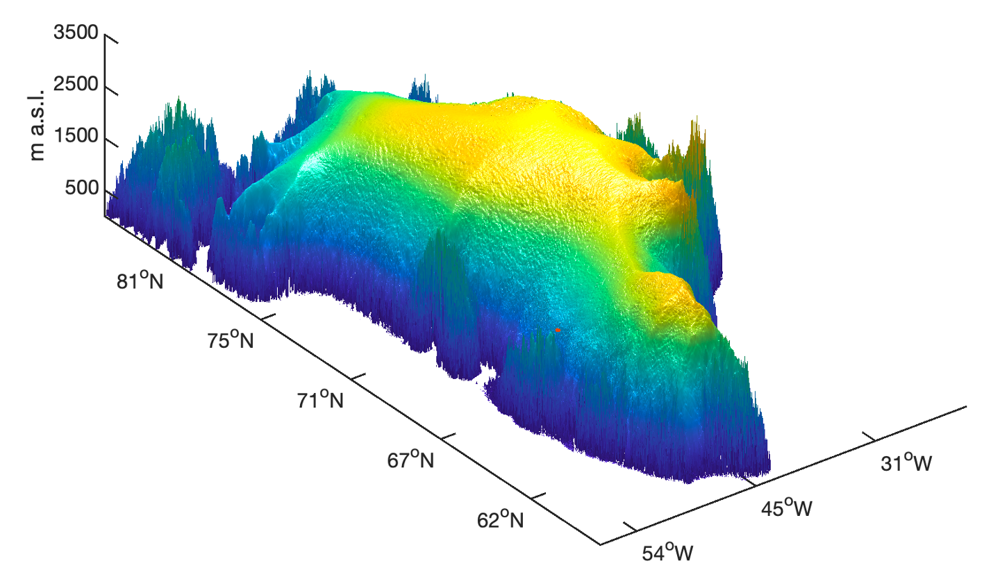
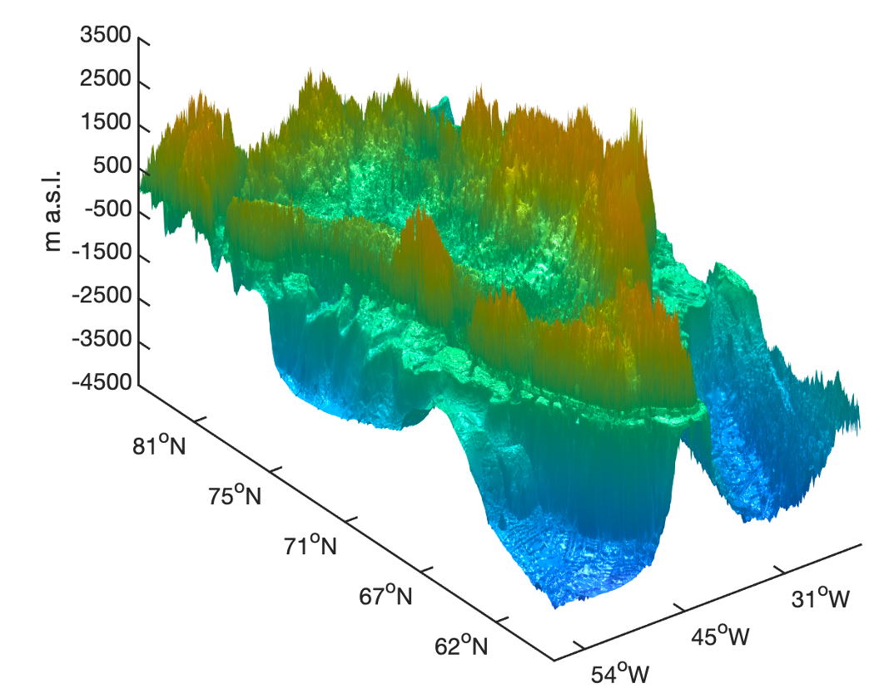
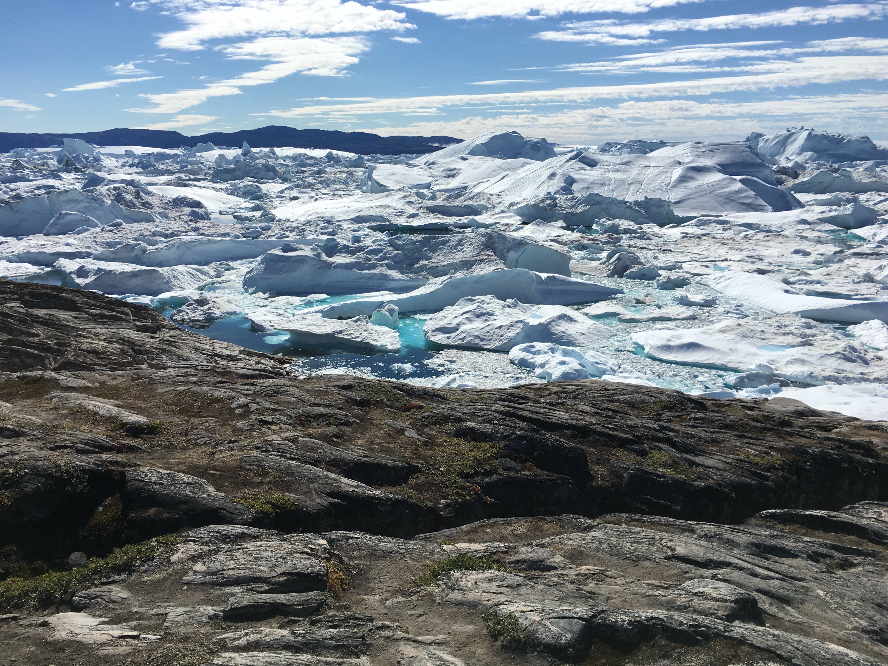

<!-- slides_GCEE6320_30Mar23_Matt_Cooper -->

<!-- _class: lead invert --> <!-- center justify this slide -->
<!-- _footer: "" --> <!-- add a footer to this slide -->

# High-Latitude Hydroclimatology: Modeling Ice Sheet Surface Mass Balance

Matt Cooper
GCEE 6320 Global Climate: Physical Models
15 April 2024
matt.cooper@pnnl.gov

<!--  -->
<!--  -->

<!-- 
Some smaller text at the footer of the page.
 -->

---

## Why do polar regions play a significant role in global climate? <!-- fit -->

<!-- use this to scope a style to one slide -->

<!--  -->
<!--  -->

- _The high albedo of snow and ice._
- _The large amount of carbon stored in permafrost._
- **The large amount of freshwater stored in glaciers.**

---

## Polar Amplification

- High-latitude regions warm faster than the global average
    - Arctic: 2.5°C
    - Antarctic: 1.5°C
    - Global: 1.1°C
- Factors: Ice-albedo feedback, changes in atmospheric and **oceanic circulation**, and increased greenhouse gases.

https://commons.wikimedia.org/wiki/File:GISS_temperature_2000-09.png

---

## Freshwater Inputs from Land and Ice Sheets

<!-- from the prior version -->
- Freshwater inputs from melting ice sheets and land runoff impact ocean salinity, circulation, and temperature.
- These changes can have far-reaching effects on global climate, marine ecosystems, and sea levels.

<!-- - Freshwater inputs from land and ice sheets have a significant impact on ocean salinity and circulation, which in turn affect ice sheet mass balance and sea level rise.
- Understanding the complex interactions between freshwater inputs and ocean processes is essential for accurate climate modeling and predicting future changes. -->

---

## Mass Balance of the Polar Ice Sheets

- Importance of ice sheet mass balance for global sea level and climate
- Factors influencing ice sheet mass balance: accumulation and ablation

---

## Observed Changes in Ice Sheet Mass Balance

- Satellite missions for observing ice sheet mass balance (e.g., GRACE, ICESat)
- Recent trends in Greenland and Antarctic ice sheet mass balance

---

## Kalaallit Nunaat (Greenland)

- Populated since ~2500 BC
- ~90% (58,000) Greenlandic Inuit, rest Danish/European
- Autonomous territory of Denmark since 1953
- Self-governed since 2008
- Maintain right to full independence (yet to exercise)

topography: BedMachineV3, Morlighem et al 2017

---

## Kalaallit Nunaat (Greenland)

- 2nd largest island on Earth
- Largest island that is not a continent
- ~3000 km (2000 mi) long, 1300 km (800 mi) wide
- ~3 km (2 mi) max thickness
- ~7.2 m (23.6 ft) sea level rise equivalent
- Lowest temperature recorded in Northern Hemisphere: -93°F (-70°C)

topography: BedMachineV3, Morlighem et al 2017

---

---

## Ice sheet surface topography
<!-- _backgroundColor: white -->
<!-- _color: black -->

topography: BedMachineV3, Morlighem et al 2017

---

<!-- _backgroundColor: white -->
<!-- _color: black -->

## Ice sheet bed topography

topography: BedMachineV3, Morlighem et al 2017

---

<!-- _backgroundColor: white -->
<!-- _color: black -->

topography: BedMachineV3, Morlighem et al 2017

---

<!-- _backgroundColor: white -->
<!-- _color: black -->

topography: BedMachineV3, Morlighem et al 2017

---

<!-- _backgroundColor: white -->
<!-- _color: black -->

---

<!-- how might one measure this velocity? -->

---

---

---

## Recap and Takeaway Messages

- High-latitude hydroclimatology is critical for understanding global climate change
- Climate models are essential tools for studying hydroclimatic processes
- Polar amplification, sea ice, permafrost, and freshwater inputs play key roles
- Ice sheet mass balance research helps predict sea level rise
